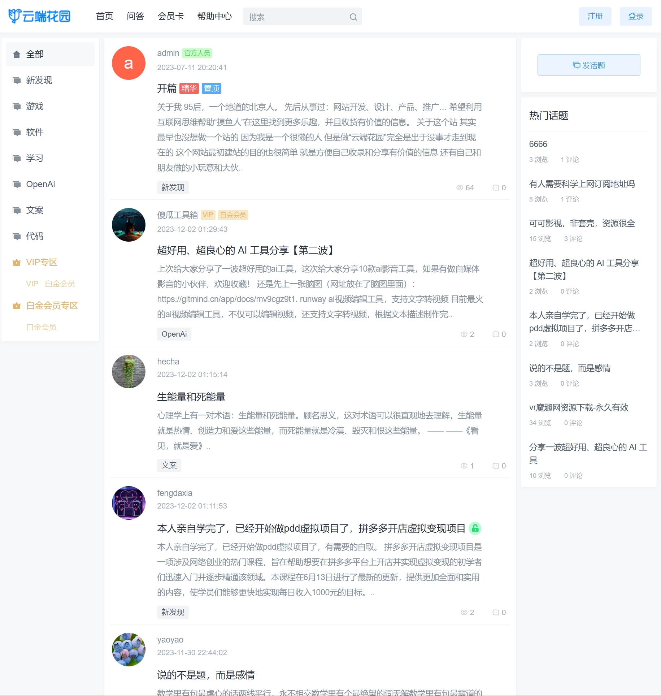
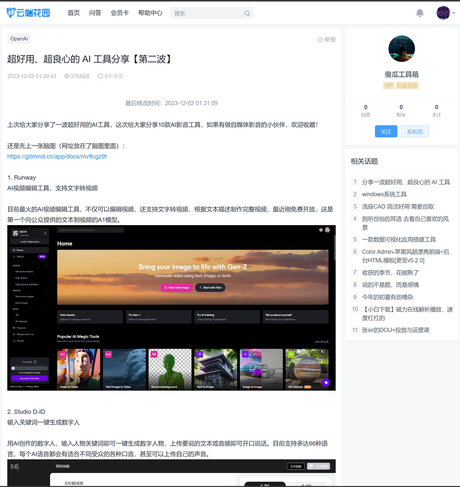
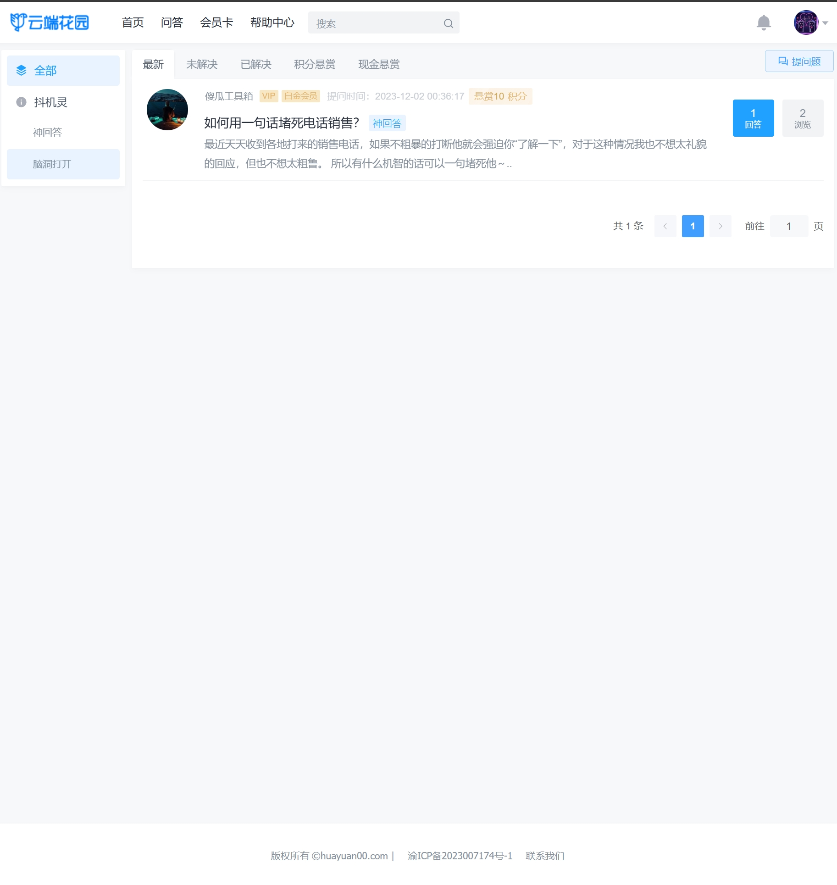
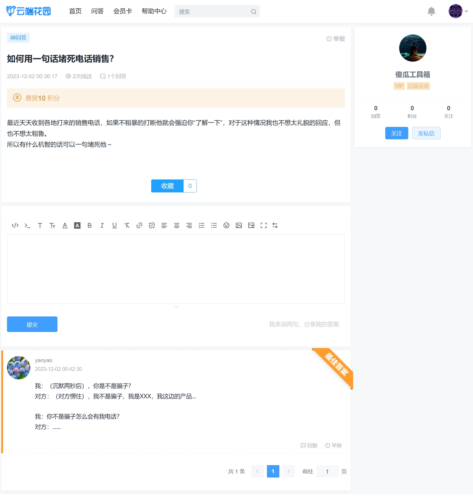

#### 项目演示
演示地址：[https://huayuan00.com](https://huayuan00.com)

#### 技术选型
Spring 5.0 + SpringMVC + JPA + Ehcache(可选Memcached) + Lucene

#### 项目介绍
云端花园轻论坛系统包含论坛、问答模块。系统采用JAVA+MYSQL架构，自适应手机端和电脑端，界面简洁，性能高效。后台数据库备份/还原、全站指定目录打包、一键自动升级等功能使维护简单方便。系统拥有强大的模板管理功能，布局版块支持设置输出条件，让前端页面展示方便快捷。

 
为了提高论坛性能，部分功能使用数据库分表设计,默认分为4个表,表中有数据后不建议再调整分表数量。程序带有图形安装界面，第一次使用需执行安装操作。前台所有页面均支持返回HTML和JSON格式数据,API接口文档可在【页面管理】 - 【模板列表】 - 【布局】 - 【版块】 中查看。前台各模块模板和
资源均可在线编辑和管理。前台电脑版和手机版各有一套模板,默认页面使用的模板技术:电脑版使用FreeMarker标签，手机版使用Vue2.0,当然也可以使用其它前端模板框架设计页面进行展示。官网发布新版本后用户可以下载升级包上传到后台进行升级。电脑版使用nuxt;

  
#### 主要功能
（1）话题（发表话题、编辑话题、发表评论、编辑评论、删除评论、发表回复、编辑回复、删除回复、审核话题、审核评论、审核回复、搜索话题

、收藏、点赞、上传视频、话题输入密码可见、话题评论可见、话题达到等级可见、话题支付积分可见、话题支付现金可见、

、标签设置角色、红包）

（2）问答（发表问题、追加问题、发表答案、编辑答案、发表回复、编辑回复、审核问题、审核答案、审核回复、搜索问题

、悬赏现金、悬赏积分、收藏、设置最佳答案）

（3）会员（会员等级、会员注册项、会员角色、会员注册禁止用户名称、会员搜索、登录日志、更换头像、私信、系统通知

、提醒、收藏夹、点赞、关注、粉丝、微信登录）

（4）员工管理(员工列表、角色列表、登录日志)

（5）会员卡管理(会员卡列表、会员卡订单)

（6）模板管理（模板列表、导出模板、导入模板、版块代码管理、资源管理、布局管理、栏目管理、代码编辑）

（7）在线帮助管理（在线帮助分类、合并分类、在线帮助列表）

（8）浏览量管理(浏览量列表)

（9）友情链接管理(友情链接列表)

（10）留言管理（留言列表）

（11）文件打包管理(压缩文件列表、打包文件)

（12）系统通知管理(系统通知列表)

（13）平台收益管理(解锁话题隐藏内容分成、问答悬赏平台分成)

（14）全站设置(基本设置、维护数据、敏感词、数据库备份/还原、服务器节点参数、升级)

（15）支付管理(在线支付接口)

（16）短信管理(短信接口列表、短信发送错误日志)

（17）第三方服务管理(第三方登录接口列表)

（18）缩略图管理(缩略图列表)

			
  

  

  

  

  